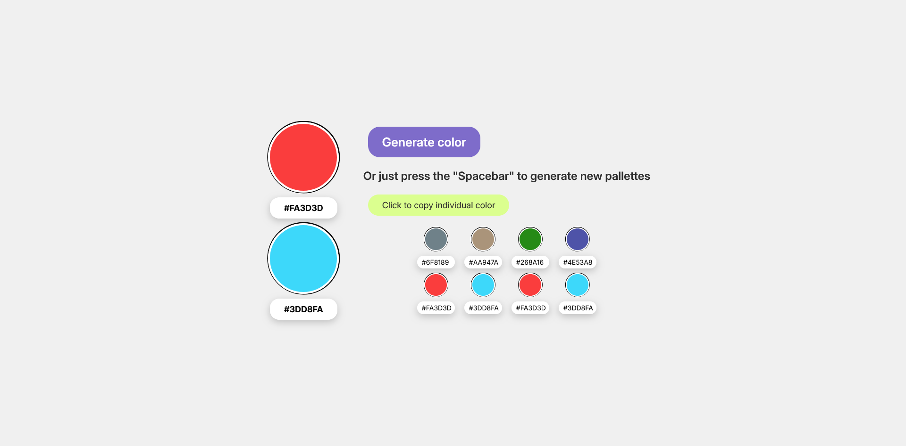

# Color Generator

A modern and interactive color palette generator with smooth animations and color history tracking.



## 🎨 Features

- **Random Color Generation** - Generate two random HEX colors at once
- **Multiple Generation Methods**
  - Click the "Generate" button
  - Press `Spacebar` for quick generation
- **Copy to Clipboard** - Click any color code to copy it instantly
- **Color History** - Keeps track of your last 8 generated colors
- **Smooth Animations**
  - Fade-in effect for main colors
  - Scale & rotate animation for history items
  - Cascading appearance with delay
- **Persistent Storage** - History saved in localStorage
- **Toast Notifications** - Beautiful notifications when copying colors

## 🚀 Demo

[Live Demo](#) _(Add your deployed link here)_

## 🛠️ Technologies Used

- HTML5
- CSS3 (with CSS Variables, Flexbox, Grid, Animations)
- Vanilla JavaScript (ES6+)
- localStorage API
- Clipboard API

## 📚 What I Learned

This project helped me practice and learn:

- **JavaScript Fundamentals:**

  - `Math.random()` and `Math.floor()` for random number generation
  - String manipulation and loops
  - Functions and return values
  - Array methods: `push()`, `splice()`, `forEach()`

- **DOM Manipulation:**

  - `querySelector()` and `querySelectorAll()`
  - Dynamic element creation with `createElement()`
  - Event listeners: `click`, `keydown`
  - Modifying styles and content dynamically

- **CSS Animations:**

  - `@keyframes` animations
  - `transition` properties
  - `transform` (scale, rotate)
  - `animation-delay` for cascading effects

- **Web APIs:**
  - localStorage for data persistence
  - Clipboard API for copying text
  - JSON methods: `stringify()` and `parse()`

## 🎯 Key Concepts

### HEX Color Format

```javascript
// HEX colors use 16 characters: 0-9 and A-F
// Format: #RRGGBB
// Example: #FA3D3D (red), #3DD8FA (blue)
```

### Random Color Generation

```javascript
function generateColor() {
  const hexChars = "0123456789ABCDEF";
  let color = "#";
  for (let i = 0; i < 6; i++) {
    const randomIndex = Math.floor(Math.random() * 16);
    color += hexChars[randomIndex];
  }
  return color;
}
```

### localStorage Usage

```javascript
// Save history
localStorage.setItem("colorHistory", JSON.stringify(colorHistory));

// Load history
let colorHistory = JSON.parse(localStorage.getItem("colorHistory")) || [];
```

## 📁 Project Structure

```
color-generator/
│
├── index.html          # Main HTML file
├── styles.css          # Main styles
├── variables.css       # CSS variables
├── scripts.js          # JavaScript functionality
└── README.md          # Project documentation
```

## 🎮 How to Use

1. **Generate Colors:**

   - Click the "Generate color" button
   - Or press `Spacebar` on your keyboard

2. **Copy Colors:**

   - Click on any HEX code (main colors or history)
   - Color will be copied to your clipboard
   - A toast notification will appear

3. **View History:**
   - Your last 8 generated colors are displayed below
   - History persists even after page reload

## 💡 Future Improvements

Potential features to add:

- [ ] Export palette as image
- [ ] Generate complementary color schemes
- [ ] Add RGB and HSL format support
- [ ] Color picker integration
- [ ] Share palette via URL
- [ ] Dark/Light theme toggle
